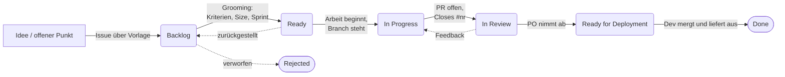
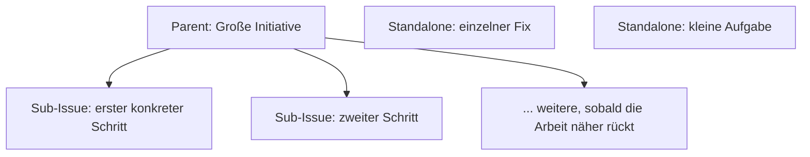

# Das Board: wie es gedacht ist

> Die inhaltliche Wahrheit über den Ablauf. Einmal lesen, bevor ihr das erste Mal groomt. Die technischen IDs stehen woanders, nämlich in `.claude/rules/github-board.md`.

**Diese Datei zieht als `board-doku.md` in euer Projekt ein.** Passt sie an, sobald ihr merkt, dass ihr anders arbeitet als hier beschrieben. Eine Doku, die von der gelebten Praxis abweicht, richtet mehr Schaden an als keine.

---

## 1. Wofür das Board da ist

Es ersetzt verstreute To-do-Listen für **atomare Entwicklungsarbeit**. Alles, was jemand anfassen und als Änderung abliefern kann.

**Was aufs Board gehört:** Fehlerbehebungen, Features, Refactorings, Infrastruktur, Dokumentation, alles mit einem konkreten Ergebnis.

**Was nicht aufs Board gehört:** Geschäftliche Entscheidungen, rechtliche Themen, strategische Fragen ohne umsetzbares Ergebnis. Die leben in euren Notizen oder eurem Second Brain. Ein Board, auf dem „Preismodell überdenken" neben „Login-Button reagiert nicht" steht, wird von beiden Seiten nicht mehr ernst genommen.

## 2. Der Lebenslauf eines Tickets



## 3. Die sieben Status

| Status | Bedeutung |
|---|---|
| **Backlog** | Idee oder offener Punkt. Kein Sprint, Grooming nicht abgeschlossen. |
| **Ready** | Akzeptanzkriterien stehen, Size gesetzt, Zuständigkeit klar, Sprint zugewiesen. Ziehbar. |
| **In Progress** | Branch steht, es wird gearbeitet. |
| **In Review** | Pull Request offen, wartet auf Prüfung. |
| **Ready for Deployment** | Fachlich abgenommen, wartet auf Merge und Auslieferung. **Setzt der Product Owner von Hand**, siehe Hinweis unten. |
| **Done** | Ausgeliefert. Wird automatisch gesetzt, wenn der PR mit `Closes #<nr>` schließt. |
| **Rejected** | Getriaged und verworfen (Duplikat, außerhalb des Scopes, überholt). Wird nicht bearbeitet. |

**Zu `Rejected`:** Der Status, den alle weglassen wollen und alle brauchen. Ohne ihn gibt es nur zwei Wege, ein Ticket loszuwerden: es fälschlich auf `Done` setzen oder es für immer im Backlog liegen lassen. Beides vergiftet das Board.

**Zu `Ready for Deployment`:** Der Abnahme-Status, und die Übergabe zurück an die Entwicklung. Der Product Owner setzt ihn von Hand, wenn er getestet hat und es fachlich passt. Er sagt damit: von meiner Seite fertig, liefert aus.

Das ist bewusst getrennt, weil **der Product Owner den Pull Request nicht selbst merged.** Wann und wohin ausgeliefert wird, hängt an Dingen, die er nicht überblickt (offene Branches, Release-Fenster, Abhängigkeiten). Er entscheidet über das Fachliche, die Entwicklung über den Zeitpunkt.

Der einzige Status, den keine Automatik bedient. Beim Merge springt das Issue anschließend von selbst auf `Done`, weil die eingebaute Regel am Schließen hängt. **Liefert ihr fortlaufend aus** und merged direkt nach der Abnahme, streicht ihn beim Setup und arbeitet mit sechs Status. Ein Status, den niemand pflegt, ist schlimmer als einer, den es nicht gibt.

## 4. Die Felder

| Feld | Typ | Wofür | Wer setzt es |
|---|---|---|---|
| **Status** | Single-Select (7) | Wo im Ablauf das Ticket steht | Automatik wo möglich, sonst von Hand |
| **Priority** | Single-Select (P0–P3) | Wie dringend | Triage, bestätigt in der Planung |
| **Size** | Single-Select (XS/S/M/L) | Aufwandsschätzung | Vorschlag beim Anlegen, bestätigt bei `Ready` |
| **Sprint** | Iteration (2 Wochen) | Zu welchem Sprint es gehört | Sprint-Planung |
| **Epic** | Single-Select | Welches Themenfeld (vertikal) | Triage |
| **Area** | Single-Select | Welche Codebase-Zone (horizontal) | Triage, optional bei querschnittlicher Arbeit |
| **Type** | Single-Select | Bug / Feature / Task | Ergibt sich aus der Vorlage, änderbar |

### Priority

| Wert | Bedeutung |
|---|---|
| **P0-blocker** | Produktion kaputt, Datenverlust droht, oder blockiert die Auslieferung. Alles andere stehenlassen. |
| **P1-high** | Vor der nächsten Auslieferung nötig, oder betrifft aktive Nutzer. Gehört in den Sprint. |
| **P2-normal** | Kann warten. Gegroomt, aber nicht dringend. |
| **P3-nice-to-have** | Kosmetik oder geringe Wirkung. Wird gezogen, wenn Kapazität übrig ist. |

### Size

| Wert | Bedeutung |
|---|---|
| **XS** | Unter 2 Stunden. Trivial, eine Datei, Konfiguration oder Einzeiler. |
| **S** | Unter einem Tag. Klein geschnitten, eine Änderung, wenige Dateien. |
| **M** | Ein bis drei Tage. Mittleres Feature oder Fix über mehrere Schichten. |
| **L** | Über drei Tage. Große Sache, **fast immer ein Kandidat zum Aufteilen in Sub-Issues.** |

## 5. Epic und Area sind zwei Achsen

Das ist die Unterscheidung, die am häufigsten verrutscht, und sie lohnt sich:

- **Epic = welches Produktthema.** Vertikal. Woran arbeitet ihr inhaltlich?
- **Area = welche Zone der Codebase.** Horizontal. Wo im Code passiert es?

Ein Ticket hat meist von jedem eins. „Login-Fehler im Kundenportal" könnte Epic `Kundenportal` und Area `backend` haben. Die Portfolio-Ansicht gruppiert nach Epic, deshalb ist das das Feld, das sitzen muss. Area darf bei querschnittlicher Arbeit leer bleiben.

**Eure Epic-Werte legt ihr in `board-setup.md` Schritt 2 fest.** Fünf bis zwölf ist ein guter Bereich. Weniger, und das Feld sagt nichts. Mehr, und niemand trifft die Auswahl mehr zuverlässig.

## 6. Die vier Ansichten

| Ansicht | Layout | Filter | Wann |
|---|---|---|---|
| **Current Sprint** | Board, gruppiert nach Status | `sprint:@current` | Das tägliche Brett. Ready → In Progress → In Review → Done. |
| **Backlog** | Tabelle | `status:"Backlog" no:"Sub-issues progress"` | Sprint-Planung. Flache Liste ziehbarer Punkte, Parents stören nicht. Nach Priority sortieren. |
| **By Epic** | Board, gruppiert nach Epic | `-status:"Done" -status:"Rejected"` | Überblick. Welche Themen laufen, welche sind still. |
| **Blockers** | Tabelle | `priority:"P0-blocker" no:"Sub-issues progress" -status:"Done" -status:"Rejected"` | Was brennt. Stehen hier mehr als fünf Punkte, ist die Planung das Problem, nicht das Board. |

> **Warum `no:"Sub-issues progress"` und nicht `-has:sub-issues`:** Weil `has:` nur `assignee`, `label` und echte Feldnamen kennt. Ein Feld `sub-issues` existiert nicht, das eingebaute heißt `Sub-issues progress`. Und GitHub ignoriert unbekannte `has:`-Werte **still**, statt einen Fehler zu melden. Eine Ansicht mit `-has:sub-issues` sieht deshalb richtig aus und filtert nichts.

## 7. Parent, Sub-Issue oder Standalone

Drei Arten von Tickets. Jedes ist genau eine davon.



| Art | Wann | Beispiel |
|---|---|---|
| **Parent** | Große Sache mit mindestens drei Teilaufgaben, über mindestens zwei Sprints. Kein Size, kein Sprint. Reiner Sammelbehälter. | Umstellung auf einen neuen Zahlungsanbieter |
| **Sub-Issue** | Ein konkretes atomares Stück der Parent-Arbeit. Hat Size, Priority, Sprint. | Konto und Zugangsdaten beim neuen Anbieter einrichten |
| **Standalone** | Einzelnes abgeschlossenes Stück, passt in einen Sprint. | Fehlermeldung beim Abbruch der Zahlung sichtbar machen |

Sub-Issues werden über GitHubs eingebaute Funktion verknüpft (Parent-Issue → Abschnitt „Sub-issues" → „Add sub-issue"). Der Fortschritt rollt automatisch als „3 von 5 erledigt" am Parent hoch.

**Sub-Issues erst anlegen, wenn die Arbeit näher rückt**, nicht auf Vorrat. Ein Parent sollte aber immer mindestens ein konkretes erstes Sub-Issue haben, sonst ist er nur eine Überschrift.

## 8. Die drei Vorlagen

| Vorlage | Wann | Erfasst |
|---|---|---|
| **Bug Report** | Etwas ist kaputt | Symptom, Reproduktion, erwartetes Verhalten, Logs, Umgebung |
| **Feature Request** | Neue Funktion | Problem, Lösungsvorschlag, Akzeptanzkriterien, Alternativen |
| **Task** | Refactoring, Recherche, Doku, Betrieb | Kontext, was zu tun ist, Definition of Done, Referenzen |

Alle drei fragen Epic und Priority ab, **schreiben sie aber nur in den Text des Issues**, nicht in die Board-Felder. Das ist eine Eigenheit von GitHub-Formularen: ein Dropdown erzeugt eine Zeile im Issue-Body, mehr nicht.

Auf die Board-Felder überträgt sie entweder `/issue-create` beim Anlegen (macht der Skill automatisch) oder die Triage von Hand. **Kommt ein Issue über die Weboberfläche herein, gehört das Übertragen in die Triage** — sonst bleibt sein Epic leer, und die By-Epic-Ansicht zeigt es nirgends. Area, Size und Sprint werden ohnehin erst auf dem Board gesetzt.

## 9. Von der Idee zum Merge

Am Beispiel eines Fehlers, der in der Produktion auffällt:

1. **Etwas fällt auf.** Ein Nutzer meldet, dass ein Vorgang ohne Rückmeldung abbricht.
2. **Issue anlegen**, Bug-Vorlage. Symptom, Reproduktion, Lösungsidee. Epic setzen, Priority schätzen. Landet im **Backlog**.
3. **Triage.** Jemand setzt Area und Size. Noch kein Sprint.
4. **Sprint-Planung.** Das Ticket wird in den Sprint genommen, Sprint-Feld gesetzt, Status auf **Ready**.
5. **Arbeit beginnt.** `/issue-implement` liest das Issue samt Kommentaren, legt einen Plan vor, und nach Freigabe entsteht ein Branch. Status auf **In Progress**.
6. **Umsetzung** entlang des Plans, Akzeptanzkriterien als Checkliste.
7. **Fertigmeldung.** `/issue-done` zieht Bilanz, öffnet den PR mit `Closes #<nr>` im Body und schreibt den Prüf-Kommentar. Status auf **In Review**.
8. **Prüfung.** Der Product Owner testet. **Passt es**, setzt er den Status auf **Ready for Deployment**: seine Abnahme, und die Übergabe zurück an die Entwicklung. **Hakt etwas**, kommt es über `/issue-feedback` als Kommentar zurück und das Ticket geht auf **In Progress**, weiter bei Schritt 5.
9. **Auslieferung.** Die Entwicklung merged den Pull Request und liefert aus. Das Issue schließt sich durch `Closes #<nr>` automatisch, Status auf **Done**.

## 10. Zusammenspiel mit Claude Code

Vier Skills decken den Kreislauf ab:

| Skill | Rolle | Macht |
|---|---|---|
| `/issue-create` | Product Owner | Stichpunkte werden ein sauberes Ticket auf dem Board |
| `/issue-implement` | Entwicklung | Ticket wird Plan, Plan wird Code |
| `/issue-done` | Entwicklung | Bilanz, PR, ab in den Review |
| `/issue-feedback` | Product Owner | Testbefunde werden Kommentar, Ticket zurück in die Arbeit |

Direkt geht natürlich auch:

```bash
gh issue view 43              # Issue samt Kommentaren lesen
gh issue list --assignee @me  # was auf dem eigenen Tisch liegt
gh issue comment 43 -b "…"    # kommentieren
```

**Für alles über XS immer erst den Plan vorlegen lassen.** Ein abgelehnter Plan kostet zwei Minuten, ein falsch gebautes Feature einen Nachmittag.

## 11. Rhythmus

- **Sprintlänge:** 2 Wochen. GitHub führt die Iterationen selbst fort, ihr müsst nichts umstellen.
- **Planung:** einmal zu Sprintbeginn. Backlog nach Priority durchgehen, Tickets in den Sprint nehmen, Sprint und Zuständigkeit setzen, auf `Ready` heben. **Kapazität ehrlich halten:** fünf fertige Tickets sind mehr wert als zehn zugesagte und sechs gelieferte.
- **Zwischendurch:** einmal in der Mitte kurz draufschauen, was hängt.
- **Sprintende:** was noch `In Progress` ist, wandert in den nächsten Sprint. Ohne schlechtes Gewissen, das ist eine Statusmeldung, kein Urteil.
- **Retro:** bei zwei Leuten überflüssig. Ab drei bis vier lohnt sie sich.
